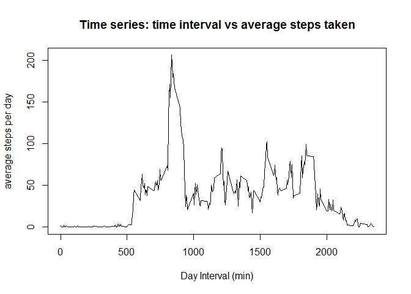
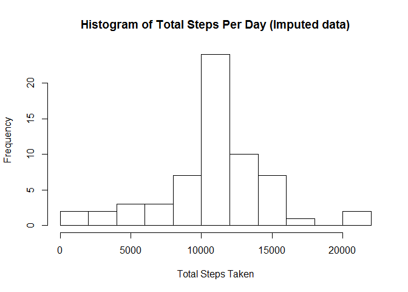
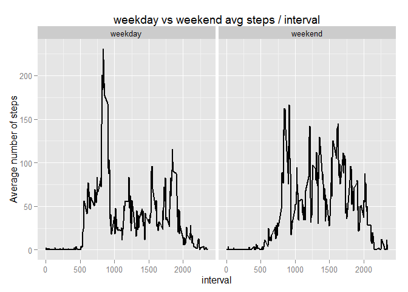

# Reproducible Research: Peer Assessment 1


## Loading and preprocessing the data


```r
a <- read.csv("./activity.csv", header = TRUE)
head(a)
```

```
##   steps       date interval
## 1    NA 2012-10-01        0
## 2    NA 2012-10-01        5
## 3    NA 2012-10-01       10
## 4    NA 2012-10-01       15
## 5    NA 2012-10-01       20
## 6    NA 2012-10-01       25
```

```r
str(a)
```

```
## 'data.frame':	17568 obs. of  3 variables:
##  $ steps   : int  NA NA NA NA NA NA NA NA NA NA ...
##  $ date    : Factor w/ 61 levels "2012-10-01","2012-10-02",..: 1 1 1 1 1 1 1 1 1 1 ...
##  $ interval: int  0 5 10 15 20 25 30 35 40 45 ...
```

Then split the data frame into convenient variables representing each name


```r
steps <- a$steps
dates <- a$date
interval <- a$interval
```

## What is mean total number of steps taken per day?
First determine the total number of steps per day; placed in a variable sumday


```r
library(dplyr)
```

```
## Warning: package 'dplyr' was built under R version 3.2.1
```

```
## 
## Attaching package: 'dplyr'
## 
## The following objects are masked from 'package:stats':
## 
##     filter, lag
## 
## The following objects are masked from 'package:base':
## 
##     intersect, setdiff, setequal, union
```

```r
timedat <- group_by(a, date)
sumday <- summarise(timedat, totalsteps = sum(steps, na.rm=TRUE))
hist(sumday$totalsteps, breaks = 9, main = "Histogram of Total Steps Per Day", xlab = "Total Steps Taken")
```

 

```r
meantot <- mean(sumday$totalsteps)
medtot <- median(sumday$totalsteps)
```

The mean total number of steps taken per day is 9354.2295082
The median total number of steps taken per day is 10395


## What is the average daily activity pattern?
Group data by interval, then summarize the interval data by average steps, which collapses all the steps per day


```r
intday <- group_by(a, interval) %>% summarise(avgsteps = mean(steps, na.rm=TRUE))
plot(intday$interval, intday$avgsteps, type="l", main="Time series: time interval vs average steps taken", xlab = "Day Interval (min)", ylab="average steps per day")
```

 

```r
maxint <- intday$interval[which(intday$avgsteps == max(intday$avgsteps))]
```

The highest activity interval on average is at the 835 interval.


## Imputing missing values
Get vector of noncomplete cases
Replace any missing step values with the mean of that time interval over all days.


```r
validdat <- !complete.cases(a)
numinval <- sum(validdat)
act <- merge(a, intday, by.x = "interval", by.y = "interval") %>% arrange(date, interval)
act$steps = ifelse(is.na(act$steps), act$avgsteps, act$steps)
totalstep <- group_by(act, date) %>% summarise(totalsteps = sum(steps))
hist(totalstep$totalsteps, breaks = 9, main = "Histogram of Total Steps Per Day (Imputed data)", xlab = "Total Steps Taken")
```

 

```r
options(scipen=999)
newmean <- mean(totalstep$totalsteps)
newmedian <- median(totalstep$totalsteps)
```

The number of invalid/missing values in the data set is 2304.
By imputing NA data with the average time interval of the missing time frame, it causes the data to be closer to a gaussian distribution. It also reduces the frequency of days where total step taken is artificially low due to lack of data.
The new mean is 10766.1886792 , and the new median is 10766.1886792 after imputing the data. The fact that mean = median shows that the data is becoming more normal.

## Are there differences in activity patterns between weekdays and weekends?
Convert and add the date column of date objects to a final data frame with the date classified as weekend or weekday

```r
library(lubridate)
```

```
## Warning: package 'lubridate' was built under R version 3.2.1
```

```r
library(ggplot2)
```

```
## Warning: package 'ggplot2' was built under R version 3.2.1
```

```r
adate <- strptime(act$date, format = "%Y-%m-%d")
activity <- cbind(act, adate)

convertday <- function(x){
    if (x == "Saturday" || x == "Sunday"){
        return ("weekend")
    }
    else
        return ("weekday")
}

activity <- mutate(activity, day= weekdays(activity$adate))
daytype <- character(length = 17568)
for (i in 1:length(daytype)){
    daytype[i] <- convertday(activity$day[i])
}

activity<-cbind(activity, daytype)

daytypeact <- group_by(activity, daytype, interval) %>% summarise(avgsteps = mean(steps, na.rm=TRUE))

activityplot <- ggplot(data = daytypeact, aes(interval, avgsteps)) + geom_line(size=1) + facet_grid(. ~daytype) + labs(title = "weekday vs weekend avg steps / interval") + labs(y = "Average number of steps")
print(activityplot)
```

 

There seems to be more activity around the 800-900 interval on weekdays, although the activity on weekends seems to be higher throughout the day. This may reflect the energy people must spend walking to work on weekdays vs going out on weekends.
